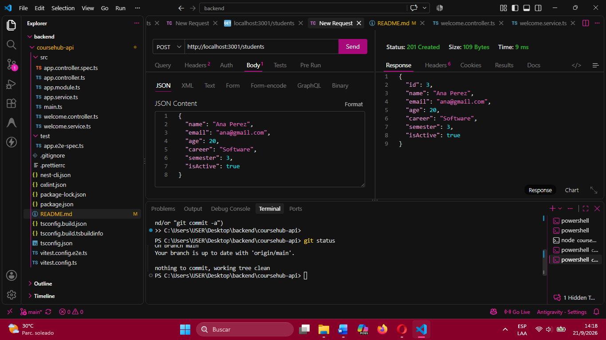
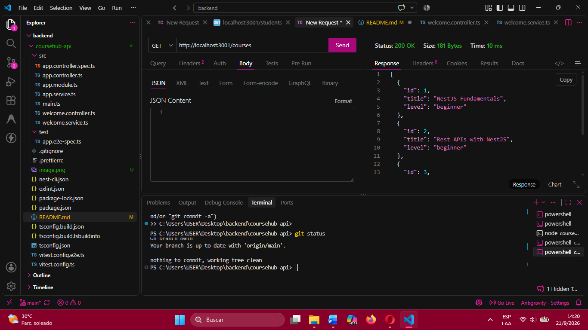
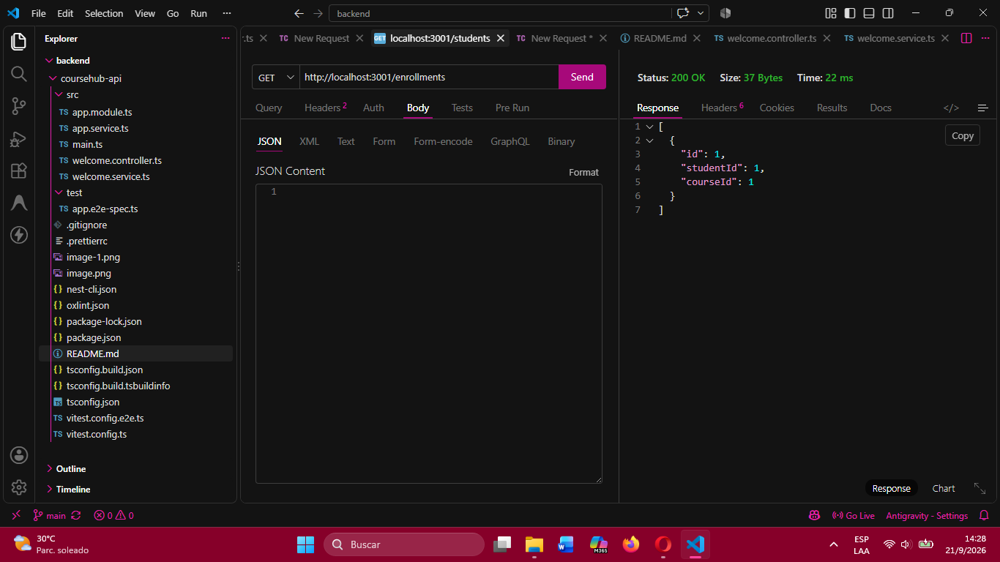
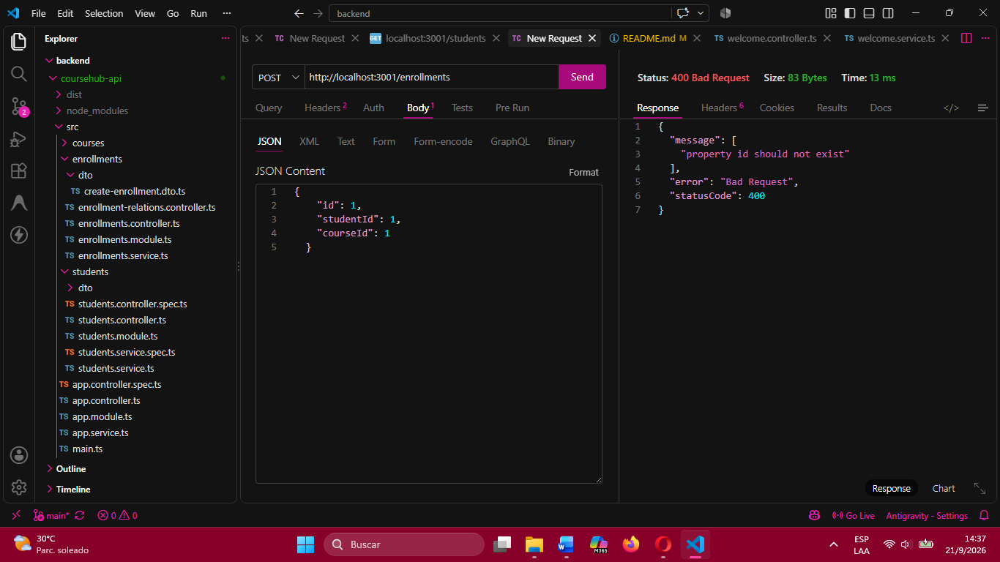
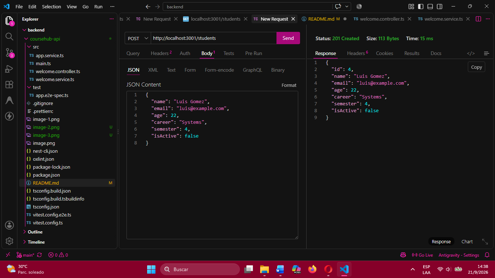
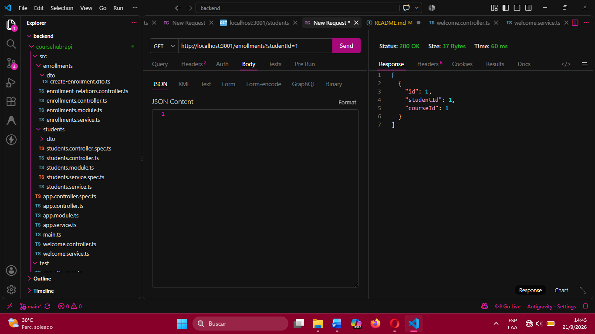
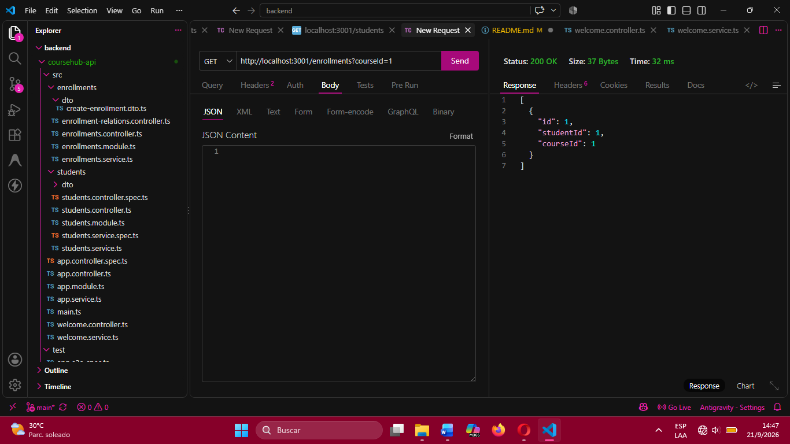
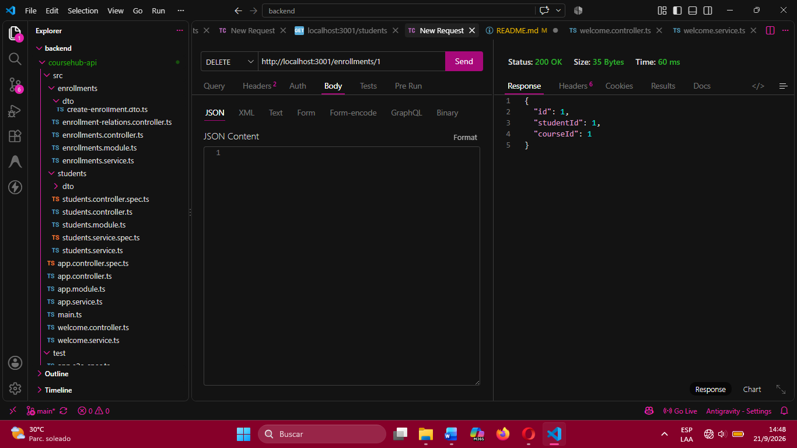
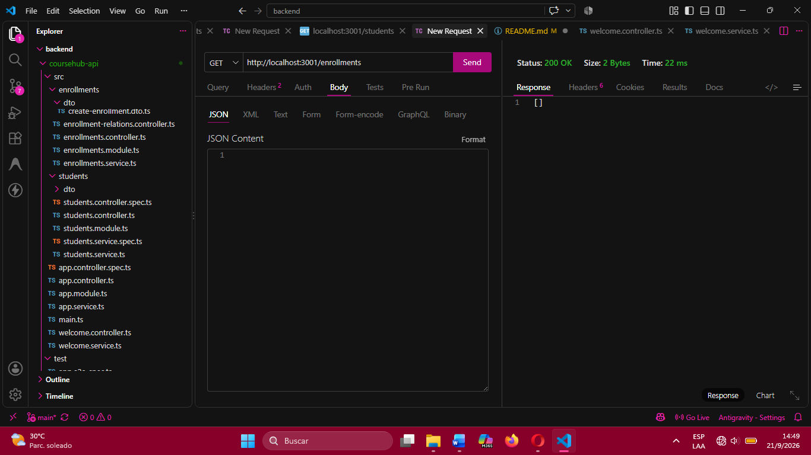

# CourseHub API

Proyecto realizado para la evaluación práctica de NestJS. La API administra: cursos, estudiantes y matrículas usando listas en memoria.

## Módulos

- **Cursos:** administra los cursos disponibles.
- **Estudiantes:** administra estudiantes y su estado activo o inactivo.
- **Matrículas:** relaciona estudiantes con cursos.

Las reglas de negocio están en los servicios. Los controladores reciben los datos y delegan el procesamiento. La aplicación usa`ValidationPipe` global con `whitelist`, `forbidNonWhitelisted` y `transform`.

## Endpoints

| Método | Endpoint | Descripción |
| --- | --- | --- |
| GET | `/courses` | Lista cursos. Acepta `level` como filtro. |
| GET | `/courses/:id` | Consulta un curso. |
| POST | `/courses` | Crea un curso. |
| PATCH | `/courses/:id` | Actualiza un curso. |
| DELETE | `/courses/:id` | Elimina un curso. |
| GET | `/students` | Lista estudiantes. |
| GET | `/students/:id` | Consulta un estudiante. |
| POST | `/students` | Crea un estudiante. |
| PATCH | `/students/:id` | Actualiza un estudiante. |
| DELETE | `/students/:id` | Elimina un estudiante. |
| POST | `/enrollments` | Registra una matrícula. |
| GET | `/enrollments` | Lista matrículas y permite filtros. |
| GET | `/enrollments/:id` | Consulta una matrícula. |
| DELETE | `/enrollments/:id` | Cancela una matrícula. |
| GET | `/students/:studentId/enrollments` | Matrículas de un estudiante. |
| GET | `/courses/:courseId/enrollments` | Matrículas de un curso. |

## Evidencias

Creacion de un nuevo estudiante:

Consultar cursos:

Consultar matricula:

No acepta matriculas duplicadas:

Se registro un nuevo estudiante:

Filtrado de estudiantes:

Filtrado de matricula por curso:

Cancelar matricula:

