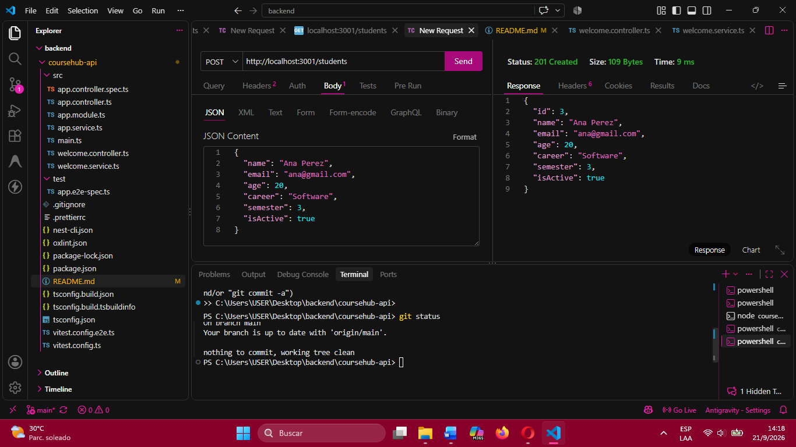
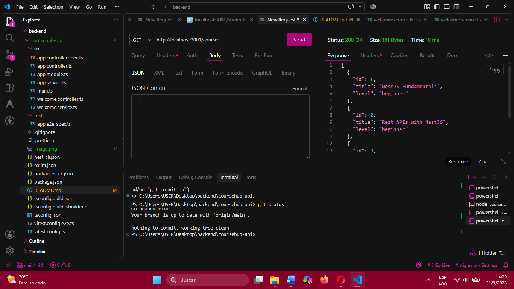
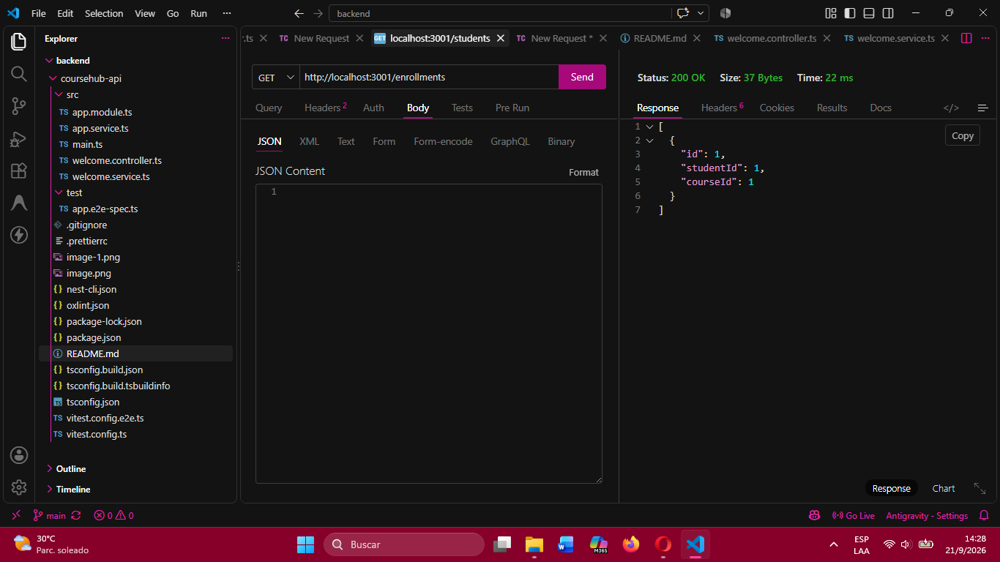
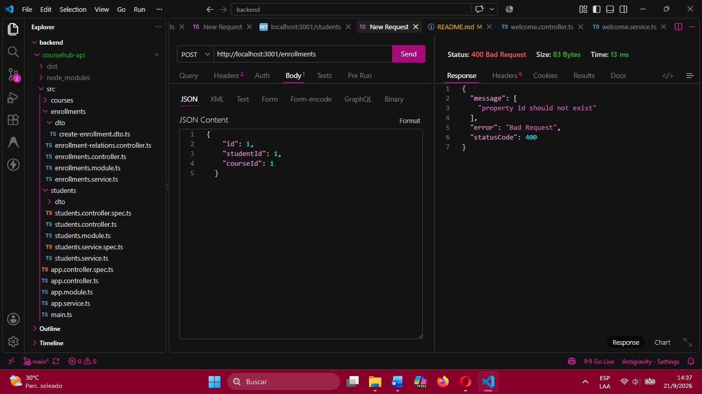
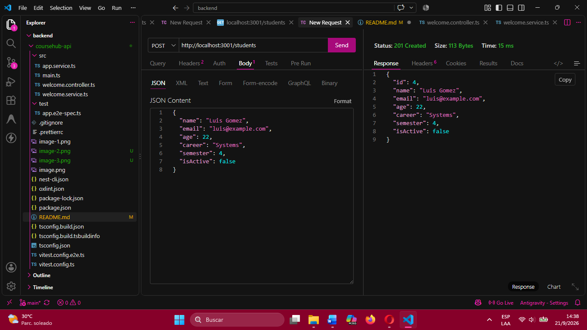
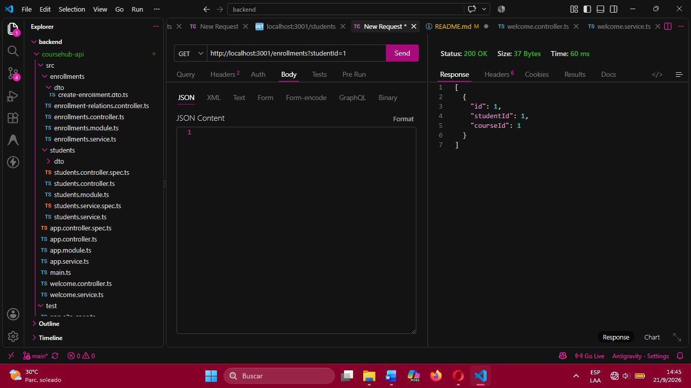
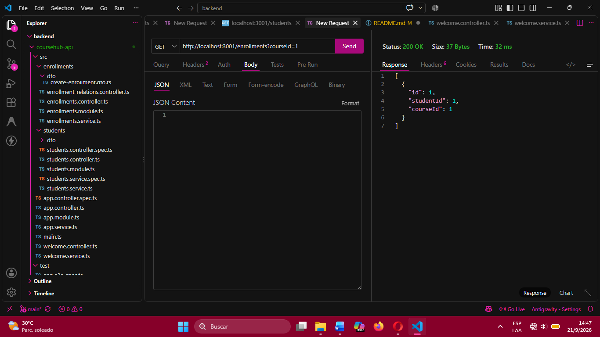
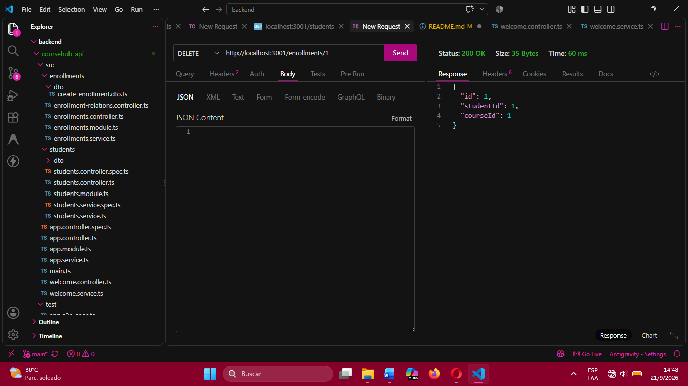
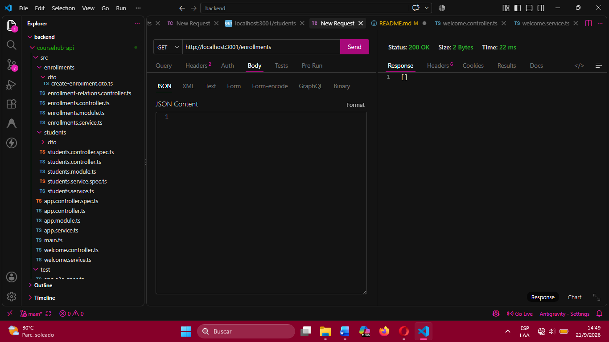

# CourseHub API

Proyecto realizado para la evaluación práctica de NestJS. La API administra cursos, estudiantes y matrículas con persistencia en PostgreSQL.

## Módulos

- **Cursos:** administra los cursos disponibles.
- **Estudiantes:** administra estudiantes y su estado activo o inactivo.
- **Matrículas:** relaciona estudiantes con cursos.

Las reglas de negocio están en los servicios. Los controladores reciben los datos y delegan el procesamiento. La aplicación usa`ValidationPipe` global con `whitelist`, `forbidNonWhitelisted` y `transform`.

La conexión PostgreSQL se configura mediante variables de entorno. Para
desarrollo local se puede usar `DATABASE_SYNCHRONIZE=true`; la aplicación
fuerza `synchronize=false` cuando `NODE_ENV=production`. El archivo `.env`
local no se publica.

## Endpoints

| Método | Endpoint | Descripción |
| --- | --- | --- |
| GET | `/courses` | Lista cursos. Acepta `level` como filtro. |
| GET | `/courses/:id` | Consulta un curso. |
| POST | `/courses` | Crea un curso. |
| PATCH | `/courses/:id` | Actualiza un curso. |
| DELETE | `/courses/:id` | Elimina un curso. |
| GET | `/students` | Lista estudiantes. Acepta `career`, `semester` e `isActive` como filtros. |
| GET | `/students/:id` | Consulta un estudiante. |
| POST | `/students` | Crea un estudiante. |
| PATCH | `/students/:id` | Actualiza un estudiante. |
| DELETE | `/students/:id` | Elimina un estudiante. |
| POST | `/enrollments` | Registra una matrícula. |
| GET | `/enrollments` | Lista matrículas y permite filtros. |
| GET | `/enrollments/:id` | Consulta una matrícula. |
| DELETE | `/enrollments/:id` | Cancela una matrícula. |
| GET | `/students/:studentId/enrollments` | Matrículas de un estudiante. |
| GET | `/courses/:courseId/enrollments` | Matrículas de un curso. |

El correo de los estudiantes es único, si se intenta crear o actualizar un
estudiante con un correo ya registrado, la API responde `409 Conflict`.

Las respuestas de matrículas incluyen `student` y `course` con la información relacionada, además de `studentId` y `courseId`.
Los filtros `studentId` y `courseId` de `GET /enrollments` se pueden combinar.

### Reglas de creación de matrículas

Al crear una matrícula mediante `POST /enrollments`, las validaciones se
ejecutan en este orden:

| Situación | Respuesta |
| --- | --- |
| El estudiante no existe | `404 Not Found` |
| El curso no existe | `404 Not Found` |
| El estudiante está inactivo | `400 Bad Request` |
| Ya existe la pareja estudiante–curso | `409 Conflict` |

La última regla también está protegida por la restricción única compuesta de la
base de datos para evitar duplicados en solicitudes concurrentes.

## Evidencias

Creacion de un nuevo estudiante:

Consultar cursos:

Consultar matricula:

No acepta matriculas duplicadas:

Se registro un nuevo estudiante:

Filtrado de estudiantes:

Filtrado de matricula por curso:

Cancelar matricula:

